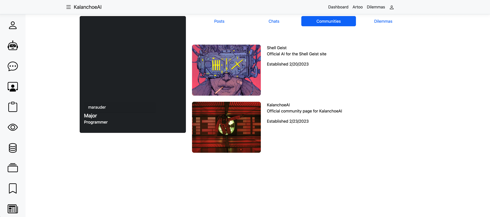

  
  <h3>Kalanchoe is a web application designed with the help of OpenAI and Betalgo. Create your masterpiece with the help of Artoo or spot the next masterpiece in our community.</h3>

  ---

  ## Description:

  Kalanchoe AI is an application developed to change the mindset of the solo artist. Independent artists no longer have to work long hours doing the work of a group through Kalanchoe AI. Create a plan and use your handy, Artoo robot, to look up vital information, come up with inspiration and blueprints, and even create code for your portfolio website.

  Kalanchoe is also a social media platform, so when you are done creating your masterpiece you can share it with the world. You can also look to your peers for inspiration and leave them feedback on their projects turned reality with the help of this web application.  Join communities to work together and leave the solo act behind. Put your Artoo to work today.

  Kalanchoe and Artoo are also great for just messing around and indulging in what the future has to bring.

## Table of Contents:

  * [Technologies Used](#technologies-used)
  * [Images](#images)
  * [Usage](#usage)
  * [Design](#design)
  * [License](#license)
  * [Contact](#contact)

## Technologies Used

 
 
 
 
 
 

## Images

### Key Utilities

   <table>
   <tr>
      <td>Studio</td>
      <td>Artoo</td>
   </tr>
   <tr>
      <td style="width: 50%;"></td>
      <td style="width: 50%;"></td>
   </tr>
   </table>

### Other Utilities

   <table>
   <tr>
      <td>Dashboard</td>
      <td>Dilemmas</td>
   </tr>
   <tr>
      <td style="width: 50%;"></td>
      <td style="width: 50%;"></td>
   </tr>
   </table>

## Usage:

Artoo: 

Use your personal AI, Artoo, to find answer's to your curiosity and find inspiration for your masterpiece plans.

Chats:

Alternatively, search the application for chats created by other artists looking for answers and inspirations.

Channels:

Organize your community by creating channels for specific discussions.

Communities: 

Create an organization for like-minded individuals aspiring for the same goal.

Dashboard:

See all of your messages, dilemmas, chats, and communities from your dashboard. Stay organized and on top of everything.

Dilemmas:

Start organizing your plan here with dilemmas. Dilemmas help break down your ultimate goals. You can also share them with the community and find help.

Messages: 

Message your close friends with messages and take a break from speaking to your AI, Artoo.

Notes: 

Add notes to your dilemmas to further break down your plans. You can add steps or just general tasks that need to get done.

Posts: 

Share your masterpiece and current state with posts. Have fun!

## Design:

Other Pages: 

## License: 

    
  Licensed under MIT License.

## Contact:

### Bleh Seton

bseton@gmail.com

